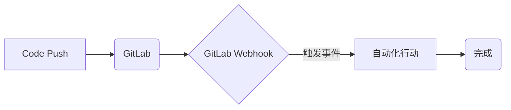
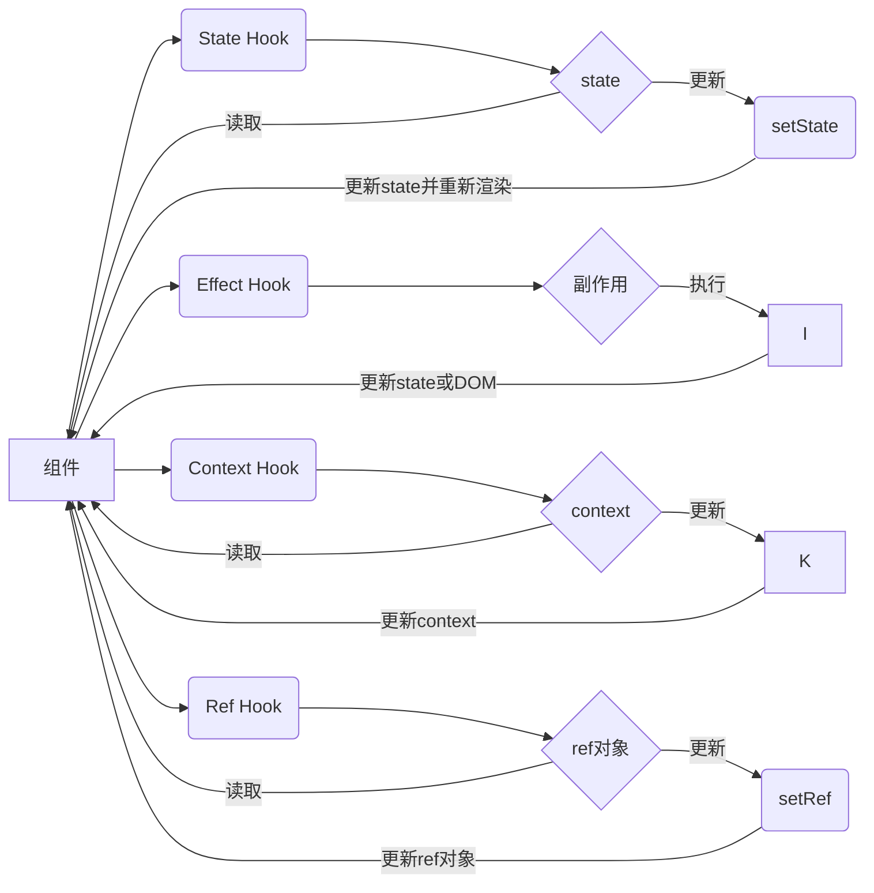

# Hook

Hook 是一个有意思的概念，用于将我们不同的模块勾连起来，使接口与接口、模块与模块之间变得更易于操作。

## WebHook

WebHook 是一种通过 HTTP 回调的方式，实现事件通知的技术。WebHook 通常用于实现自动化行动，例如：代码提交后自动部署、代码合并后自动构建、代码合并后自动测试等。

## Hook 与函数式编程

常用的Hook设计模式包括：Pre-hook、Post-hook、Filter-hook、Event-hook。

React Hooks 和 Vue3 Composition API 都是在函数式编程中使用的技术，因此常用的设计模式与函数式编程中的一些设计模式有些相似，比如高阶函数、柯里化、函数组合等。

常用的 Hooks 设计模式包括：

State Hooks：用于在函数组件中管理状态，例如 useState、useReducer 等。

Effect Hooks：用于在组件渲染后执行副作用操作，例如 useEffect、useLayoutEffect 等。

Context Hooks：用于在组件树中共享数据，例如 useContext 等。

Ref Hooks：用于在组件中保存可变的数据，例如 useRef、useCallback 等。

Custom Hooks：自定义 Hooks 可以将多个 Hooks 封装成一个函数，以实现复杂的逻辑重用，例如 useDebounce、useThrottle 等。

